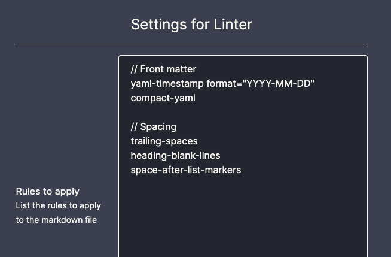

# Obsidian Linter

This Obsidian plugin applies consistent styling to your markdown files.
Rules can be added or removed in the settings.

## Usage

To lint the current file, run `Lint the current file` (`Ctrl+Alt+L` by default).

### Settings

Add a rule by adding its alias in the settings. The listed rules are applied in order.

## Development Instructions

Pull requests are welcome, especially for new rules.

To add a new rule, edit `rules.ts`.

Run `npm test` to test the plugin.
Run `npm run docs` to generate the documentation.

## Rules

Documentation for all rules can be found in the [rules docs](docs/rules.md).

- [Trailing spaces](docs/rules.md#trailing-spaces)
- [Headings should be surrounded by blank lines](docs/rules.md#headings-should-be-surrounded-by-blank-lines)
- [Space after list markers](docs/rules.md#space-after-list-markers)
- [YAML Timestamp](docs/rules.md#yaml-timestamp)
- [Compact YAML](docs/rules.md#compact-yaml)
- [Header Increment](docs/rules.md#header-increment)
- [Multiple consecutive blank lines](docs/rules.md#multiple-consecutive-blank-lines)
