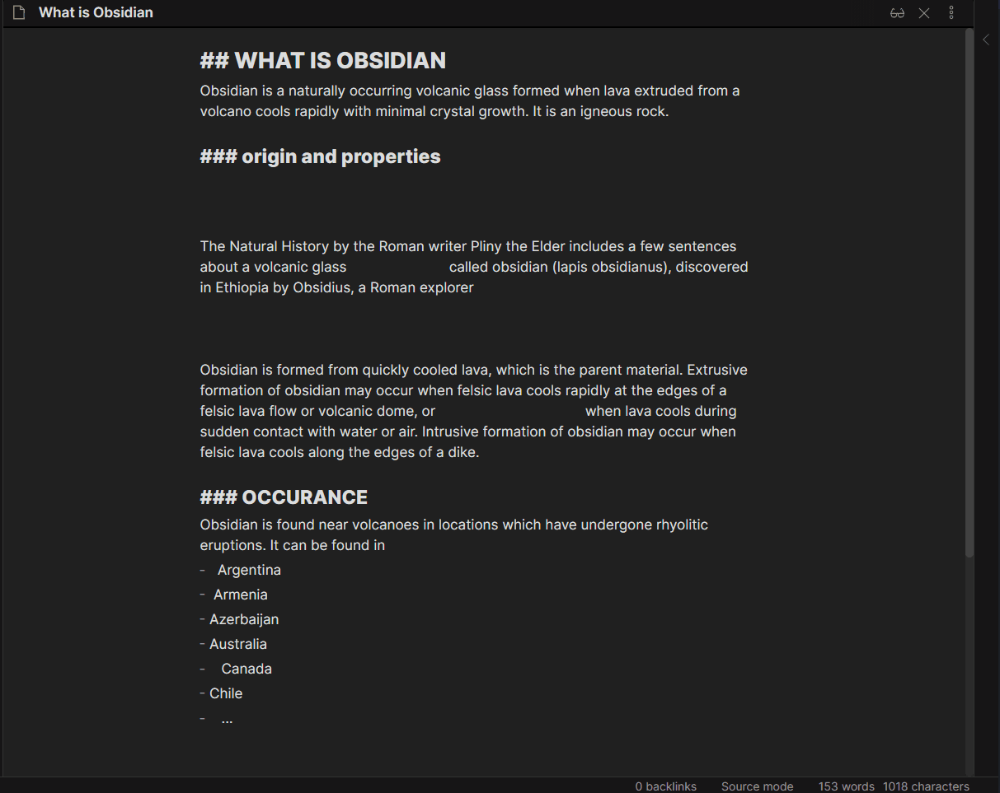

<!--- This file was automatically generated. See docs.ts and *_template.md files for the source. -->
# Obsidian Linter


This Obsidian plugin formats and styles your notes with a focus on configurability and extensibility.
Rules can be toggled and configured in the settings.

## Usage



To lint the current file, run `Lint the current file` (`Ctrl+Alt+L` by default).
To lint all files, run `Lint all files in the vault`.
To lint all files in the current folder run `Lint all files in the current folder`. This action includes all subfolders.  
You can also lint a folder by right clicking on it in the folder list and selecting "Lint folder" from the options.


When `Lint on save` is toggled on, the plugin will lint the current file on manual save (when you press `Ctrl+S`).

### Disable rules

```markdown
---
disabled rules: [capitalize-headings]
---
```

Add `disabled rules: [ ... ]` to the YAML frontmatter of a file to disable those rules when linting that file.

Add `disabled rules: [ all ]` to the YAML frontmatter of a file to disable all rules.

## Rules

Documentation for all rules can be found in the [rules docs](https://github.com/platers/obsidian-linter/blob/master/docs/rules.md). The docs are updated before the plugin is released, so may not be completely accurate.


### YAML rules

- [format-tags-in-yaml](https://github.com/platers/obsidian-linter/blob/master/docs/rules.md#format-tags-in-yaml)
- [insert-yaml-attributes](https://github.com/platers/obsidian-linter/blob/master/docs/rules.md#insert-yaml-attributes)
- [yaml-timestamp](https://github.com/platers/obsidian-linter/blob/master/docs/rules.md#yaml-timestamp)
- [yaml-title](https://github.com/platers/obsidian-linter/blob/master/docs/rules.md#yaml-title)
- [yaml-title-alias](https://github.com/platers/obsidian-linter/blob/master/docs/rules.md#yaml-title-alias)
- [escape-yaml-special-characters](https://github.com/platers/obsidian-linter/blob/master/docs/rules.md#escape-yaml-special-characters)

### Heading rules

- [header-increment](https://github.com/platers/obsidian-linter/blob/master/docs/rules.md#header-increment)
- [file-name-heading](https://github.com/platers/obsidian-linter/blob/master/docs/rules.md#file-name-heading)
- [capitalize-headings](https://github.com/platers/obsidian-linter/blob/master/docs/rules.md#capitalize-headings)

### Footnote rules

- [move-footnotes-to-the-bottom](https://github.com/platers/obsidian-linter/blob/master/docs/rules.md#move-footnotes-to-the-bottom)
- [re-index-footnotes](https://github.com/platers/obsidian-linter/blob/master/docs/rules.md#re-index-footnotes)
- [footnote-after-punctuation](https://github.com/platers/obsidian-linter/blob/master/docs/rules.md#footnote-after-punctuation)

### Content rules

- [remove-multiple-spaces](https://github.com/platers/obsidian-linter/blob/master/docs/rules.md#remove-multiple-spaces)
- [remove-hyphenated-line-breaks](https://github.com/platers/obsidian-linter/blob/master/docs/rules.md#remove-hyphenated-line-breaks)
- [remove-consecutive-list-markers](https://github.com/platers/obsidian-linter/blob/master/docs/rules.md#remove-consecutive-list-markers)
- [remove-empty-list-markers](https://github.com/platers/obsidian-linter/blob/master/docs/rules.md#remove-empty-list-markers)
- [convert-bullet-list-markers](https://github.com/platers/obsidian-linter/blob/master/docs/rules.md#convert-bullet-list-markers)
- [proper-ellipsis](https://github.com/platers/obsidian-linter/blob/master/docs/rules.md#proper-ellipsis)
- [emphasis-style](https://github.com/platers/obsidian-linter/blob/master/docs/rules.md#emphasis-style)
- [strong-style](https://github.com/platers/obsidian-linter/blob/master/docs/rules.md#strong-style)
- [no-bare-urls](https://github.com/platers/obsidian-linter/blob/master/docs/rules.md#no-bare-urls)
- [two-spaces-between-lines-with-content](https://github.com/platers/obsidian-linter/blob/master/docs/rules.md#two-spaces-between-lines-with-content)

### Spacing rules

- [trailing-spaces](https://github.com/platers/obsidian-linter/blob/master/docs/rules.md#trailing-spaces)
- [heading-blank-lines](https://github.com/platers/obsidian-linter/blob/master/docs/rules.md#heading-blank-lines)
- [paragraph-blank-lines](https://github.com/platers/obsidian-linter/blob/master/docs/rules.md#paragraph-blank-lines)
- [space-after-list-markers](https://github.com/platers/obsidian-linter/blob/master/docs/rules.md#space-after-list-markers)
- [remove-empty-lines-between-list-markers-and-checklists](https://github.com/platers/obsidian-linter/blob/master/docs/rules.md#remove-empty-lines-between-list-markers-and-checklists)
- [compact-yaml](https://github.com/platers/obsidian-linter/blob/master/docs/rules.md#compact-yaml)
- [consecutive-blank-lines](https://github.com/platers/obsidian-linter/blob/master/docs/rules.md#consecutive-blank-lines)
- [convert-spaces-to-tabs](https://github.com/platers/obsidian-linter/blob/master/docs/rules.md#convert-spaces-to-tabs)
- [line-break-at-document-end](https://github.com/platers/obsidian-linter/blob/master/docs/rules.md#line-break-at-document-end)
- [space-between-chinese-and-english-or-numbers](https://github.com/platers/obsidian-linter/blob/master/docs/rules.md#space-between-chinese-and-english-or-numbers)
- [remove-link-spacing](https://github.com/platers/obsidian-linter/blob/master/docs/rules.md#remove-link-spacing)


## Installing

As of version [0.9.7 of Obsidian](https://forum.obsidian.md/t/obsidian-release-v0-9-7-insider-build/7628), this plugin is available to be installed directly from within the app. The plugin can be found in the Community Plugins directory which can be accessed from the Settings pane under Third Party Plugins.

## Manual installation

1. Download the [latest release](https://github.com/platers/obsidian-linter/releases/latest)
1. Extract the obsidian-linter folder from the zip to your vault's plugins folder: `<vault>/.obsidian/plugins/`  
Note: On some machines the `.obsidian` folder may be hidden. On MacOS you should be able to press `Command+Shift+Dot` to show the folder in Finder.
1. Reload Obsidian
1. If prompted about Safe Mode, you can disable safe mode and enable the plugin.

## Development Instructions

Pull requests are welcome, especially for new rules.

1. Fork this repository
2. Clone the repository
3. Run `npm ci` to install dependencies
4. Add a new rule in `rules.ts`.
   1. Insert a new rule in the corresponding rule type(spacing, headings, etc)
   2. Follow the format of the existing rules
   3. Add tests for edge cases in `test.ts`
   4. You should probably use some helper functions from `utils.ts`, such as `ignoreCodeBlocksYAMLTagsAndLinks`.
5. Run `npm run compile` to build, generate documentation, and test the plugin.
6. Run `npm run lint` to lint the plugin.

_Make sure to use Node 15.x or higher._

## Creating a Release

In order to create a release, there are a couple of steps to go through:

1. Update the version number in `versions.json`, `package.json`, and `manifest.json`.
2. Once the version change is merged into master, go to the [releases tab](https://github.com/platers/obsidian-linter//releases/latest) and select draft a new release.
3. Then you can type in the new tag which should be the version of the release (i.e. `1.3.4`) and have it create the tag on creation of the release.
4. Auto fill the release using the option to "Generate release notes".
5. Then attach the compiled `main.js` and `manifest.json` to the release before publishing the release.
