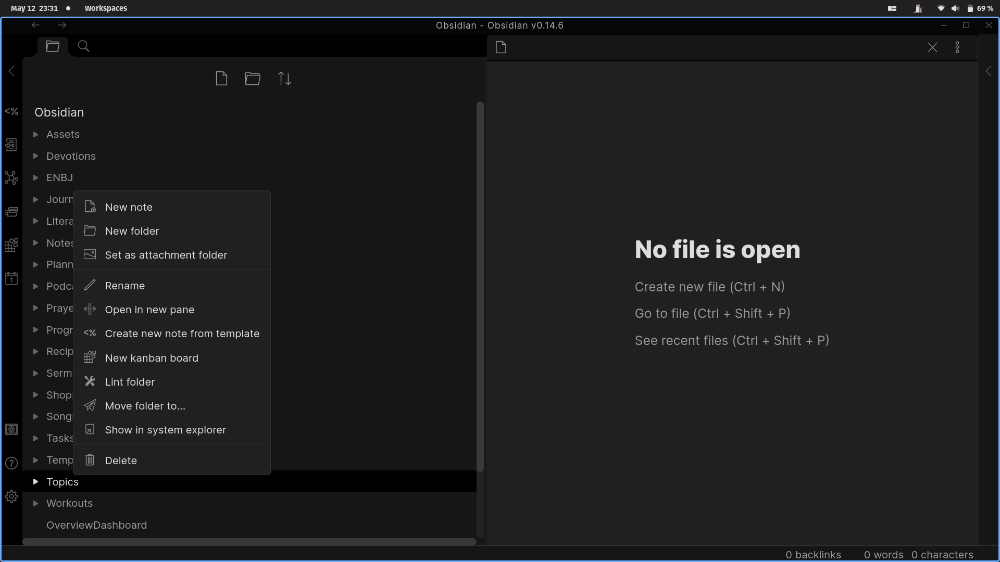

<!--- This file was automatically generated. See docs.ts and *_template.md files for the source. -->
# Obsidian Linter


This Obsidian plugin formats and styles your notes with a focus on configurability and extensibility.
Rules can be toggled and configured in the settings.

## Usage


To lint the current file, run `Lint the current file` (`Ctrl+Alt+L` by default).
To lint all files, run `Lint all files in the vault`.
To lint all files in the current folder run `Lint all files in the current folder`. This action includes all subfolders.  
You can also lint a folder by right clicking on it in the folder list and selecting "Lint folder" from the options.



When `Lint on save` is toggled on, the plugin will lint the current file on manual save (when you press `Ctrl+S`).

### Disable rules

```markdown
---
disabled rules: [capitalize-headings]
---
```

Add `disabled rules: [ ... ]` to the YAML frontmatter of a file to disable those rules when linting that file.

Add `disabled rules: [ all ]` to the YAML frontmatter of a file to disable all rules.

## Rules

Documentation for all rules can be found in the [rules docs](https://github.com/platers/obsidian-linter/blob/master/docs/rules.md). The docs are updated before the plugin is released, so may not be completely accurate.


### YAML rules

- [escape-yaml-special-characters](https://github.com/platers/obsidian-linter/blob/master/docs/rules.md#escape-yaml-special-characters)
- [format-tags-in-yaml](https://github.com/platers/obsidian-linter/blob/master/docs/rules.md#format-tags-in-yaml)
- [format-yaml-array](https://github.com/platers/obsidian-linter/blob/master/docs/rules.md#format-yaml-array)
- [insert-yaml-attributes](https://github.com/platers/obsidian-linter/blob/master/docs/rules.md#insert-yaml-attributes)
- [remove-yaml-keys](https://github.com/platers/obsidian-linter/blob/master/docs/rules.md#remove-yaml-keys)
- [yaml-key-sort](https://github.com/platers/obsidian-linter/blob/master/docs/rules.md#yaml-key-sort)
- [yaml-timestamp](https://github.com/platers/obsidian-linter/blob/master/docs/rules.md#yaml-timestamp)
- [yaml-title](https://github.com/platers/obsidian-linter/blob/master/docs/rules.md#yaml-title)
- [yaml-title-alias](https://github.com/platers/obsidian-linter/blob/master/docs/rules.md#yaml-title-alias)

### Heading rules

- [capitalize-headings](https://github.com/platers/obsidian-linter/blob/master/docs/rules.md#capitalize-headings)
- [file-name-heading](https://github.com/platers/obsidian-linter/blob/master/docs/rules.md#file-name-heading)
- [header-increment](https://github.com/platers/obsidian-linter/blob/master/docs/rules.md#header-increment)

### Footnote rules

- [footnote-after-punctuation](https://github.com/platers/obsidian-linter/blob/master/docs/rules.md#footnote-after-punctuation)
- [move-footnotes-to-the-bottom](https://github.com/platers/obsidian-linter/blob/master/docs/rules.md#move-footnotes-to-the-bottom)
- [re-index-footnotes](https://github.com/platers/obsidian-linter/blob/master/docs/rules.md#re-index-footnotes)

### Content rules

- [convert-bullet-list-markers](https://github.com/platers/obsidian-linter/blob/master/docs/rules.md#convert-bullet-list-markers)
- [emphasis-style](https://github.com/platers/obsidian-linter/blob/master/docs/rules.md#emphasis-style)
- [no-bare-urls](https://github.com/platers/obsidian-linter/blob/master/docs/rules.md#no-bare-urls)
- [proper-ellipsis](https://github.com/platers/obsidian-linter/blob/master/docs/rules.md#proper-ellipsis)
- [remove-consecutive-list-markers](https://github.com/platers/obsidian-linter/blob/master/docs/rules.md#remove-consecutive-list-markers)
- [remove-empty-list-markers](https://github.com/platers/obsidian-linter/blob/master/docs/rules.md#remove-empty-list-markers)
- [remove-hyphenated-line-breaks](https://github.com/platers/obsidian-linter/blob/master/docs/rules.md#remove-hyphenated-line-breaks)
- [remove-multiple-spaces](https://github.com/platers/obsidian-linter/blob/master/docs/rules.md#remove-multiple-spaces)
- [strong-style](https://github.com/platers/obsidian-linter/blob/master/docs/rules.md#strong-style)
- [two-spaces-between-lines-with-content](https://github.com/platers/obsidian-linter/blob/master/docs/rules.md#two-spaces-between-lines-with-content)

### Spacing rules

- [compact-yaml](https://github.com/platers/obsidian-linter/blob/master/docs/rules.md#compact-yaml)
- [consecutive-blank-lines](https://github.com/platers/obsidian-linter/blob/master/docs/rules.md#consecutive-blank-lines)
- [convert-spaces-to-tabs](https://github.com/platers/obsidian-linter/blob/master/docs/rules.md#convert-spaces-to-tabs)
- [empty-line-around-code-fences](https://github.com/platers/obsidian-linter/blob/master/docs/rules.md#empty-line-around-code-fences)
- [empty-line-around-tables](https://github.com/platers/obsidian-linter/blob/master/docs/rules.md#empty-line-around-tables)
- [heading-blank-lines](https://github.com/platers/obsidian-linter/blob/master/docs/rules.md#heading-blank-lines)
- [line-break-at-document-end](https://github.com/platers/obsidian-linter/blob/master/docs/rules.md#line-break-at-document-end)
- [paragraph-blank-lines](https://github.com/platers/obsidian-linter/blob/master/docs/rules.md#paragraph-blank-lines)
- [remove-empty-lines-between-list-markers-and-checklists](https://github.com/platers/obsidian-linter/blob/master/docs/rules.md#remove-empty-lines-between-list-markers-and-checklists)
- [remove-link-spacing](https://github.com/platers/obsidian-linter/blob/master/docs/rules.md#remove-link-spacing)
- [remove-space-around-fullwidth-characters](https://github.com/platers/obsidian-linter/blob/master/docs/rules.md#remove-space-around-fullwidth-characters)
- [space-after-list-markers](https://github.com/platers/obsidian-linter/blob/master/docs/rules.md#space-after-list-markers)
- [space-between-chinese-and-english-or-numbers](https://github.com/platers/obsidian-linter/blob/master/docs/rules.md#space-between-chinese-and-english-or-numbers)
- [trailing-spaces](https://github.com/platers/obsidian-linter/blob/master/docs/rules.md#trailing-spaces)


## Installing

As of version [0.9.7 of Obsidian](https://forum.obsidian.md/t/obsidian-release-v0-9-7-insider-build/7628), this plugin is available to be installed directly from within the app. The plugin can be found in the Community Plugins directory which can be accessed from the Settings pane under Third Party Plugins.

### Manual installation

1. Download the [latest release](https://github.com/platers/obsidian-linter/releases/latest)
1. Extract the obsidian-linter folder from the zip to your vault's plugins folder: `<vault>/.obsidian/plugins/`  
Note: On some machines the `.obsidian` folder may be hidden. On MacOS you should be able to press `Command+Shift+Dot` to show the folder in Finder.
1. Reload Obsidian
1. If prompted about Safe Mode, you can disable safe mode and enable the plugin.

## Contributing

Contributions are welcome, especially for new rules. If this is something you would like to do, take a look at the
[contribution guidelines](CONTRIBUTING.md).
