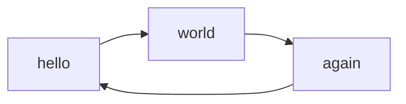

# Overview

The Linter is an [Obsidian.md](https://obsidian.md/) plugin that is designed to help keep your notes in a more uniform pattern.
It is designed to allow the user to specify which rules and settings to use so that they can try to make
their notes as uniform as possible. This includes, but is not limited to, rules that affect the YAML frontmatter,
markdown headings, github flavored footnotes, general markdown content, spacing, and pasting content within the app.

## How it Works

