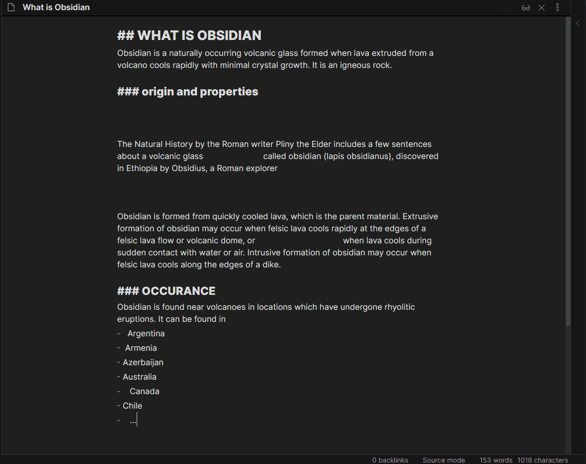

# Usage

There are several different ways in which you can run the Linter.

## On Save

This plugin has an option where you can lint the current file when you save it using `Ctrl+S` or `:w` if you use vim keybindings.
You will need to turn on the setting for `Lint on save` for this to work.

Enabling this setting keeps you from having to manually run the Obsidian Command to a lint a file whenever you want to lint the current file.

## On File Close or File Change

There is an option to lint a file when a user either closes it or swaps to a different file. In order to activate this rule,
you will need to turn on the setting for `Lint on File Change`.

This way of linting a file can help out if you forget to run the Linter on files before changing to a new file or closing it.

## Obsidian Commands

| Obsidian Command | Description | Default Keybinding |
| ---------------- | ----------- | ------------------ |
| `Lint the current file` | Runs the Linter rules against the current file | `Ctrl+Alt+L` |
| `Lint all files in the vault` | Runs the Linter rules against all files in the vault | N/A |
| `Lint all files in the current folder` | Runs the Linter against all files in the current folder and its subfolders | N/A |

Here is an example of linting the current file via an Obsidian Command:

## File Menu Action Items

There is also the option to lint files or folders by right clicking on them from the file menu and then selecting the corresponding dropdown options.

Here is what the action item for lint file looks like from the file menu:

Here is what the action item for lint folder looks like from the file menu:

